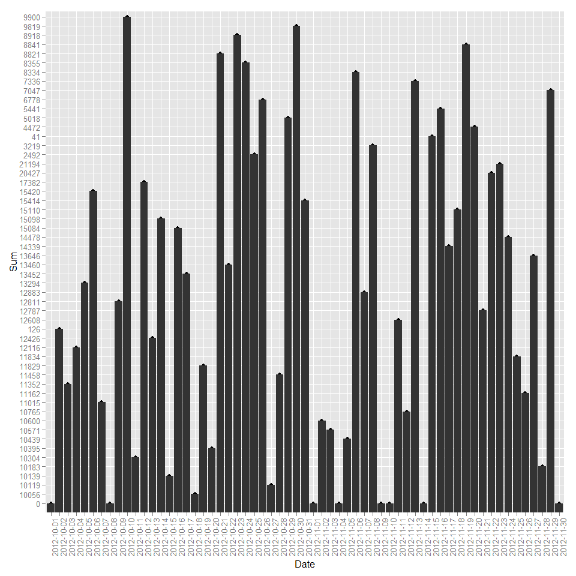
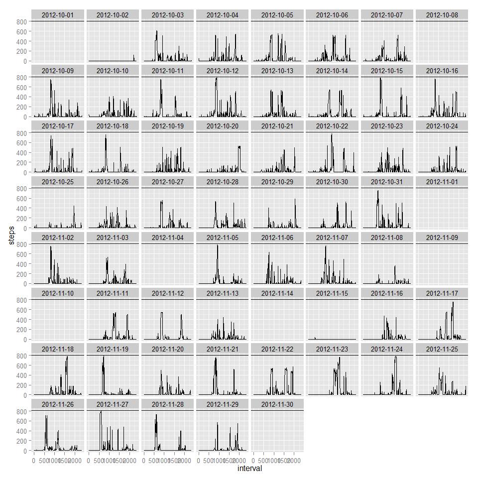
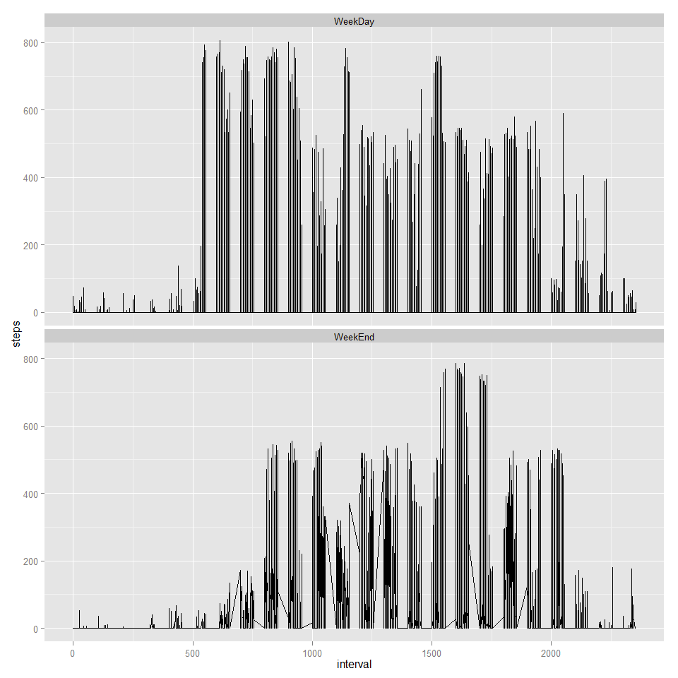

# Reproducible Research: Peer Assessment 1
by Patrick L  
Monday, August 11, 2014  

This page presents the result of some basic data analyses performed  on <a href="https://d396qusza40orc.cloudfront.net/repdata%2Fdata%2Factivity.zip"> this dataset</a>. It contains data describing personal movements of an anonymous user (henceforth called Customer A) collected using activity monitoring devices (AMD).

The number of steps taken by Customer A was collected at 5 minutes intervals throughout the day. Two months worth of data from October and November, 2012 are available in the dataset.

## Obtaining the data
To analyze the data, it needs to be obtained/downloaded from the link above. 

```r
# fileURL <- "https://d396qusza40orc.cloudfront.net/repdata%2Fdata%2Factivity.zip"
# download.file(fileURL, destfile="activity.zip")
```
The dowloaded file is then unzipped to extract the csv dataset.

```r
# unzip("activity.zip")
```


## Loading and preprocessing the data
Data is supplied in a csv file that need to be loaded into the rawdata dataframe from where it can be manipulated

```r
rawdata<- read.csv("activity.csv")
```
There is a need to peek into the raw data for an idea of the structure in case any conversion is needed.

```r
str(rawdata)
```

```
## 'data.frame':	17568 obs. of  3 variables:
##  $ steps   : int  NA NA NA NA NA NA NA NA NA NA ...
##  $ date    : Factor w/ 61 levels "2012-10-01","2012-10-02",..: 1 1 1 1 1 1 1 1 1 1 ...
##  $ interval: int  0 5 10 15 20 25 30 35 40 45 ...
```
This shows that the Date attribute has been imported as a factor. both steps and Interval have been properly imported as numeric values. Data manipulation ca be commenced.


## What is mean total number of steps taken per day?
To get to the total number of steps taken each day by Customer A, there is a need to extract all the days during which data was recorded.

```r
dateList<- unique(rawdata$date)
```
This will allow us to parse the raw data and create another data frame containing Customer A's daily steps Statistics.

```r
stepsStatistics <- c()

for(idate in dateList){
  subList<- subset(rawdata, date ==idate)
  StepsSum <- sum(subList$steps, na.rm=TRUE)
  StepsMean <- mean(subList$steps, na.rm=TRUE)
  StepsMedian <- median(subList$steps, na.rm=FALSE)
  stepsStatistics<-rbind(stepsStatistics,c(idate,StepsSum,StepsMean,StepsMedian ))
  }
stepsStatistics<-as.data.frame(stepsStatistics)
```
Now let's rename the columns of the new data frame

```r
colnames(stepsStatistics) <- c("Date","Sum","Mean","Median")
```
As described in the above instruction, the new dataframe is structured as follows:</br>

- column 1: Date
- column 2: Sum of steps
- column 3: Average number of steps
- column 4: Median

From here, the histogram describing the number of steps taken each day by Customer A can be obtained. But first, the library needs to be imported

```r
library(ggplot2)
```
and the plot designed </br>

```r
q<- qplot(Date, Sum, data=stepsStatistics)
q + geom_bar(stat = "identity")+ theme(axis.text.x = element_text(angle = 90, hjust = 1))
```

 
In addition the daily statistics of customer A are as follows:


```
##          Date   Sum              Mean Median
## 1  2012-10-01     0               NaN   <NA>
## 2  2012-10-02   126            0.4375      0
## 3  2012-10-03 11352  39.4166666666667      0
## 4  2012-10-04 12116  42.0694444444444      0
## 5  2012-10-05 13294  46.1597222222222      0
## 6  2012-10-06 15420  53.5416666666667      0
## 7  2012-10-07 11015  38.2465277777778      0
## 8  2012-10-08     0               NaN   <NA>
## 9  2012-10-09 12811  44.4826388888889      0
## 10 2012-10-10  9900            34.375      0
## 11 2012-10-11 10304  35.7777777777778      0
## 12 2012-10-12 17382  60.3541666666667      0
## 13 2012-10-13 12426  43.1458333333333      0
## 14 2012-10-14 15098  52.4236111111111      0
## 15 2012-10-15 10139  35.2048611111111      0
## 16 2012-10-16 15084            52.375      0
## 17 2012-10-17 13452  46.7083333333333      0
## 18 2012-10-18 10056  34.9166666666667      0
## 19 2012-10-19 11829  41.0729166666667      0
## 20 2012-10-20 10395          36.09375      0
## 21 2012-10-21  8821  30.6284722222222      0
## 22 2012-10-22 13460  46.7361111111111      0
## 23 2012-10-23  8918  30.9652777777778      0
## 24 2012-10-24  8355  29.0104166666667      0
## 25 2012-10-25  2492  8.65277777777778      0
## 26 2012-10-26  6778  23.5347222222222      0
## 27 2012-10-27 10119  35.1354166666667      0
## 28 2012-10-28 11458  39.7847222222222      0
## 29 2012-10-29  5018  17.4236111111111      0
## 30 2012-10-30  9819          34.09375      0
## 31 2012-10-31 15414  53.5208333333333      0
## 32 2012-11-01     0               NaN   <NA>
## 33 2012-11-02 10600  36.8055555555556      0
## 34 2012-11-03 10571  36.7048611111111      0
## 35 2012-11-04     0               NaN   <NA>
## 36 2012-11-05 10439  36.2465277777778      0
## 37 2012-11-06  8334           28.9375      0
## 38 2012-11-07 12883  44.7326388888889      0
## 39 2012-11-08  3219  11.1770833333333      0
## 40 2012-11-09     0               NaN   <NA>
## 41 2012-11-10     0               NaN   <NA>
## 42 2012-11-11 12608  43.7777777777778      0
## 43 2012-11-12 10765  37.3784722222222      0
## 44 2012-11-13  7336  25.4722222222222      0
## 45 2012-11-14     0               NaN   <NA>
## 46 2012-11-15    41 0.142361111111111      0
## 47 2012-11-16  5441  18.8923611111111      0
## 48 2012-11-17 14339  49.7881944444444      0
## 49 2012-11-18 15110  52.4652777777778      0
## 50 2012-11-19  8841  30.6979166666667      0
## 51 2012-11-20  4472  15.5277777777778      0
## 52 2012-11-21 12787  44.3993055555556      0
## 53 2012-11-22 20427  70.9270833333333      0
## 54 2012-11-23 21194  73.5902777777778      0
## 55 2012-11-24 14478  50.2708333333333      0
## 56 2012-11-25 11834  41.0902777777778      0
## 57 2012-11-26 11162  38.7569444444444      0
## 58 2012-11-27 13646  47.3819444444444      0
## 59 2012-11-28 10183  35.3576388888889      0
## 60 2012-11-29  7047          24.46875      0
## 61 2012-11-30     0               NaN   <NA>
```


## What is the average daily activity pattern?
To get a sense of the daily activity average of Customer A, lets look at a time series showing the number of steps taken per day during those two months.<br/>

```r
g<- ggplot(rawdata, aes(x=interval, y=steps))
g+geom_line()+facet_wrap(~date)+geom_hline(yintercept=max(rawdata$steps, na.rm=TRUE))
```

 
<br/>A horitontal line is added to show the maximum number of steps taken over the two months period. It shows that on 2012-11-27, Customer A's AMD counted 806 steps at the 6th hour 5mn mark.
This is also visible by subsetting the raw data to the maximum number of steps ever taken by Customer A as recorded by the AMD.

```r
subset(rawdata, steps==max(rawdata$steps, na.rm=TRUE))
```

```
##       steps       date interval
## 16492   806 2012-11-27      615
```

Another perspective is to look at all the 5mn intervals across all the days in the dataset and determine with one appear on average to be the one with the most activity. For that, we need to extract the interval with the maximum number of steps for a day. This will be repeated for each day to construct another data frame of maximum steps.

```r
maxIntervals <- c() # The new data frame
for(idate in dateList){ # for each day
  subList<- subset(rawdata, date ==idate) # Subset to that day
  maxSubset <- max(subList$steps, na.rm=TRUE) # retreive the maximum number of steps
  maxIntervalRow <- subset(subList, steps==maxSubset) # extract that row
  maxIntervals<-rbind(maxIntervals,maxIntervalRow) # add it to the new data frame.
}
```
With the new dataframe ready, we find the average interval to be 1186.0909, which corresponds to approximately the 12th hour and 35th minute.<br/>

## Imputing missing values
The number of rows with missing values are obtained using the <b>complete.cases()</b> function.

```r
library(plyr)
missingValues <- count(complete.cases(rawdata))
```
The count reveals that 2304 observations have missing value which is 15.0943 % of the data.
<br/>
Let's replace missing values are with the <b>average number of steps for the day</b>.


```r
for(index in 1:nrow(rawdata)){ # scan through the data frame
  if(!complete.cases(rawdata[index,])){ # if case is not complete - mising values detected
    idate <- as.character(rawdata$date[index]) # get the date
    s<- subset(stepsStatistics, Date==idate) # look in the Statisctics table and return the stats for given date
    s$Mean <- as.numeric(as.character(s$Mean))
    if(is.nan(s$Mean)){ # if mean is Not a Number or is missing, then replace with zero
      replacement <- 0
    }
    else {# else use the mean for that day as a replacement.
      replacement <- s$Mean
    }
    rawdata$steps[index] <- replacement
  }
}
```
<br/>and save the vew dataset in another file <i>activityNoNA.csv</i>

```r
write.csv(rawdata,"activityNoNA.csv")
```

With the new dataset, lets re-explore our data 


```r
stepsStatistics <- c()
for(idate in dateList){
  subList<- subset(rawdata, date ==idate)
  StepsSum <- sum(subList$steps, na.rm=TRUE)
  StepsMean <- mean(subList$steps, na.rm=TRUE)
  StepsMedian <- median(subList$steps, na.rm=FALSE)
  stepsStatistics<-rbind(stepsStatistics,c(idate,StepsSum,StepsMean,StepsMedian ))
  }
stepsStatistics<-as.data.frame(stepsStatistics)
colnames(stepsStatistics) <- c("Date","Sum","Mean","Median")
```

and the re-plot: </br>


```r
q<- qplot(Date, Sum, data=stepsStatistics)
q + geom_bar(stat = "identity")+ theme(axis.text.x = element_text(angle = 90, hjust = 1))
```

 

The new daily statitics are as follows:

```
##          Date   Sum              Mean Median
## 1  2012-10-01     0                 0      0
## 2  2012-10-02   126            0.4375      0
## 3  2012-10-03 11352  39.4166666666667      0
## 4  2012-10-04 12116  42.0694444444444      0
## 5  2012-10-05 13294  46.1597222222222      0
## 6  2012-10-06 15420  53.5416666666667      0
## 7  2012-10-07 11015  38.2465277777778      0
## 8  2012-10-08     0                 0      0
## 9  2012-10-09 12811  44.4826388888889      0
## 10 2012-10-10  9900            34.375      0
## 11 2012-10-11 10304  35.7777777777778      0
## 12 2012-10-12 17382  60.3541666666667      0
## 13 2012-10-13 12426  43.1458333333333      0
## 14 2012-10-14 15098  52.4236111111111      0
## 15 2012-10-15 10139  35.2048611111111      0
## 16 2012-10-16 15084            52.375      0
## 17 2012-10-17 13452  46.7083333333333      0
## 18 2012-10-18 10056  34.9166666666667      0
## 19 2012-10-19 11829  41.0729166666667      0
## 20 2012-10-20 10395          36.09375      0
## 21 2012-10-21  8821  30.6284722222222      0
## 22 2012-10-22 13460  46.7361111111111      0
## 23 2012-10-23  8918  30.9652777777778      0
## 24 2012-10-24  8355  29.0104166666667      0
## 25 2012-10-25  2492  8.65277777777778      0
## 26 2012-10-26  6778  23.5347222222222      0
## 27 2012-10-27 10119  35.1354166666667      0
## 28 2012-10-28 11458  39.7847222222222      0
## 29 2012-10-29  5018  17.4236111111111      0
## 30 2012-10-30  9819          34.09375      0
## 31 2012-10-31 15414  53.5208333333333      0
## 32 2012-11-01     0                 0      0
## 33 2012-11-02 10600  36.8055555555556      0
## 34 2012-11-03 10571  36.7048611111111      0
## 35 2012-11-04     0                 0      0
## 36 2012-11-05 10439  36.2465277777778      0
## 37 2012-11-06  8334           28.9375      0
## 38 2012-11-07 12883  44.7326388888889      0
## 39 2012-11-08  3219  11.1770833333333      0
## 40 2012-11-09     0                 0      0
## 41 2012-11-10     0                 0      0
## 42 2012-11-11 12608  43.7777777777778      0
## 43 2012-11-12 10765  37.3784722222222      0
## 44 2012-11-13  7336  25.4722222222222      0
## 45 2012-11-14     0                 0      0
## 46 2012-11-15    41 0.142361111111111      0
## 47 2012-11-16  5441  18.8923611111111      0
## 48 2012-11-17 14339  49.7881944444444      0
## 49 2012-11-18 15110  52.4652777777778      0
## 50 2012-11-19  8841  30.6979166666667      0
## 51 2012-11-20  4472  15.5277777777778      0
## 52 2012-11-21 12787  44.3993055555556      0
## 53 2012-11-22 20427  70.9270833333333      0
## 54 2012-11-23 21194  73.5902777777778      0
## 55 2012-11-24 14478  50.2708333333333      0
## 56 2012-11-25 11834  41.0902777777778      0
## 57 2012-11-26 11162  38.7569444444444      0
## 58 2012-11-27 13646  47.3819444444444      0
## 59 2012-11-28 10183  35.3576388888889      0
## 60 2012-11-29  7047          24.46875      0
## 61 2012-11-30     0                 0      0
```
There is no visible difference when the missing data is substituted with the means of values for each day.

## Are there differences in activity patterns between weekdays and weekends?

Let's add an attribute to the raw data that cesribes the day of the week as either "weekday" or "Weekend"...

```r
for(index in 1:nrow(rawdata)){ # scan through the data frame
  wday <- weekdays(as.Date(rawdata$date[index]))
  if(wday %in% c("Saturday","Sunday")){ 
    rawdata$day[index] <- "WeekEnd"
  }
  else {# 
    rawdata$day[index] <- "WeekDay"
  }
}
rawdata$day<- factor(rawdata$day)
```
<br/> ... and plot the data with faceting and line using the newly added attribute.

```r
h<- ggplot(rawdata, aes(x=interval, y=steps))
h+geom_line()+facet_wrap(~day, nrow = 2)
```

 
The plot shows that Customer A was more active Weekdays than weekends.
This is verified with cross tabultation on the raw data

```r
xtabs(steps~day, data = rawdata)
```

```
## day
## WeekDay WeekEnd 
##  396916  173692
```
that shows more steps counted weekdays than weekends.
